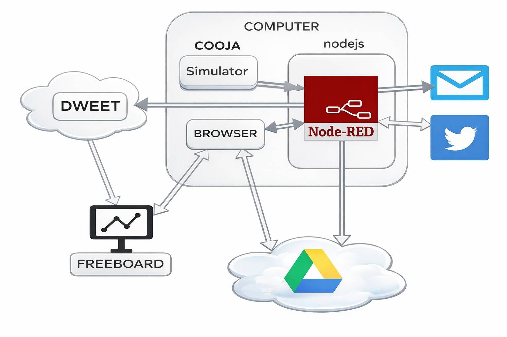
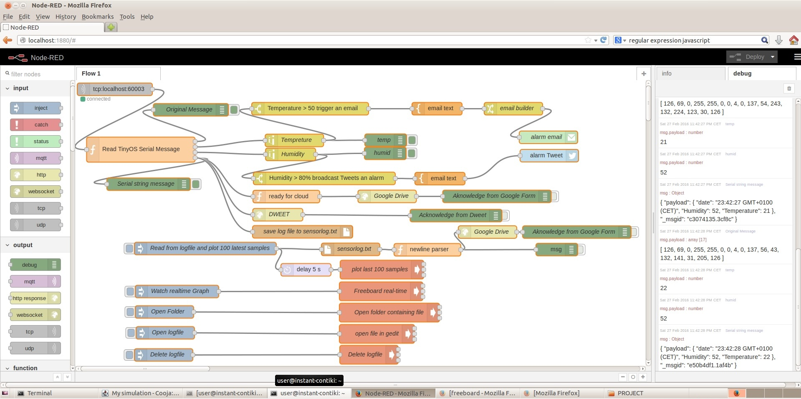
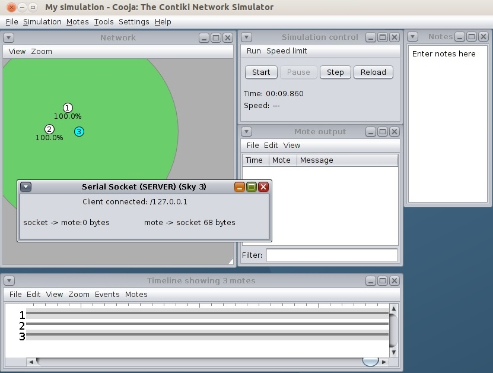
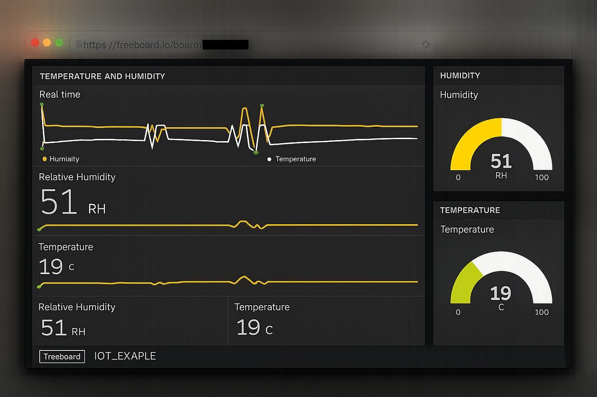
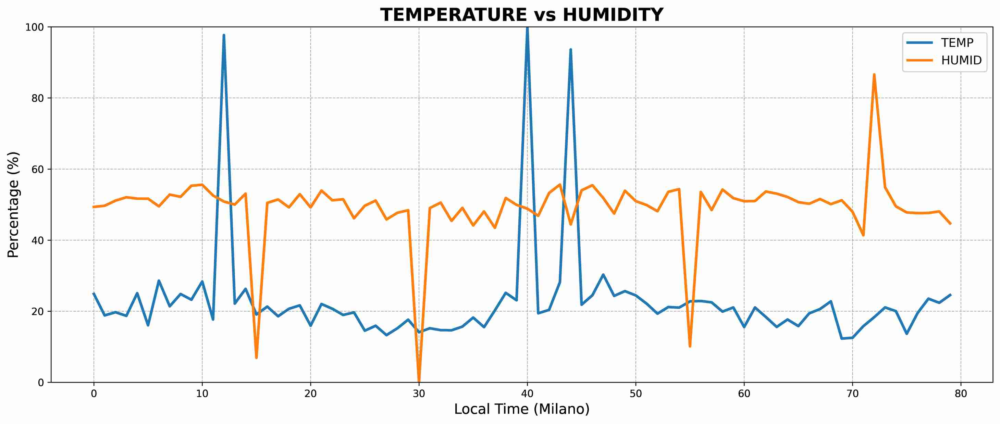

# TinyOS WSN (IoT) → Node-RED Sensor Data Logger + Cooja Simulation

An end-to-end IoT / WSN demo showing how to:

- simulate **TinyOS TelosB (Sky) motes** in **Cooja**
- forward sink data via **Serial Socket → TCP**
- parse TinyOS serial frames in **Node-RED**
- log and visualize sensor data (file logging, dweet/freeboard, Google Sheets)
- trigger alerts (email / tweet thresholds)

## Architecture

```
[Temp Mote] --\
               \ (ActiveMessage RADIO_MSG=6)
                \
                 \                   (SerialActiveMessage SERIAL_MSG=0x89)
[Hum  Mote] -------> [Sink Mote] -----------------------------------------------> [Cooja Serial Socket :60003]
                                                                                              |
                                                                                              v
                                                                                        [Node-RED TCP IN]
                                                   |-----------------------------+------------------------------+-------------------------|
                                                   |                             |                              |                         |
                                            local log file                 dweet.io (realtime)           Google Form/Sheet             alerts
                                          sensorlog.txt (JSON)             freeboard dashboard          chart (last samples)         email/tweet
```

## Scenario

The WSN consists of one **Sink/Server node (PAN coordinator)** and **two sensor nodes** (temperature and humidity).

1. Each sensor node boots, starts its radio, reads its sensor value, and sends a packet that includes:
   - a **type ID** (to distinguish temperature vs humidity)
   - the **16-bit sensor sample** in the payload
2. The sink listens for incoming packets.
3. When the sink receives a packet, it checks the type ID and stores the value in the corresponding variable.
4. Once the sink has samples from both sensors, it packs them into a serial message and sends it to the PC.
5. In Cooja, the sink’s serial output is exposed via **Serial Socket** (TCP on localhost).
6. Node-RED listens on the same TCP port, parses the incoming TinyOS serial frames, and:
   - logs data to `sensorlog.txt`
   - optionally pushes data to cloud dashboards (Dweet/Freeboard, Google Sheets)
   - triggers alarms (email for high temperature, tweet for high humidity)

## Repository Structure

- `TinyOS/`
  - `Temp/` Temperature sensor node (broadcasts `msg_type=1`)
  - `Hum/` Humidity sensor node (broadcasts `msg_type=2`)
  - `Sink/` Sink node (receives both, forwards combined serial payload)
- `Node-RED/flows.json` Node-RED flow export (JSON)
- `cooja/projectIoT.csc` Cooja simulation configuration
- `media/` project screenshots

## How it Works (data formats)

### Radio message (Temp/Hum → Sink)

Active Message type: `RADIO_MSG = 6`

Payload struct (radio):

```c
typedef nx_struct mag_msg {
  nx_uint8_t  msg_type; // 1=temp, 2=hum
  nx_uint16_t data;     // raw 16-bit sample
} mag_msg_t;
```

### Serial message (Sink → Node-RED)

Serial AM type: `SERIAL_MSG = 0x89` (decimal `137`)

Payload struct (serial):

```c
typedef nx_struct mags_msg {
  nx_uint16_t datat; // temp raw
  nx_uint16_t datah; // hum raw
} mags_msg_t;
```

Node-RED parses TinyOS HDLC-framed serial packets (0x7E … 0x7E), extracts 4 payload bytes
(2 bytes temp + 2 bytes humidity), and scales them to 0–100.

## Requirements

- A Linux environment with:
  - **Cooja** (Instant Contiki VM works)
  - **TinyOS toolchain** for TelosB / MSP430 (to build `main.exe`)
  - **Node-RED**
- Optional (for the “cloud” parts):
  - a **Google Form** connected to a Google Sheet (for logging/plotting)
  - **dweet.io** + **freeboard.io** dashboard

## Build the TinyOS applications

From each TinyOS app folder, build for TelosB:

```bash
cd "TinyOS/Temp"
make telosb

cd "../Hum"
make telosb

cd "../Sink"
make telosb
```

This produces:

- `build/telosb/main.exe` in each directory

## Run the Cooja simulation

1. Start Cooja.
2. Open the simulation:
   - `File → Open simulation…`
   - select `cooja Simulation file/projectIoT.csc`
3. Ensure each mote type points to the correct `main.exe` firmware.
4. Open the Serial Socket plugin:
   - `Tools → Serial Socket`
   - select the **Sink mote** (Sky 3 / ID 3)
   - choose **Server** mode
   - port: **60003**
5. Start the simulation.

## Run Node-RED

1. Start Node-RED:
   ```bash
   node-red
   ```
2. Open:
   - `http://localhost:1880`
3. Import the flow:
   - Menu (☰) → Import → Clipboard
   - paste the content of `Node-RED/noderedflows`
4. Update configuration:
   - `tcp in` node: host `localhost`, port `60003`
   - file path for `sensorlog.txt` (default: `./sensorlog.txt`)
   - (optional) configure:
     - Email node credentials
     - Twitter node credentials
     - Google Form URL / entry IDs
     - Dweet and Freeboard configuration
5. Deploy.

## Screenshots

### Project Diagram



### Node-RED Flow



### Cooja + Serial Socket



### Freeboard realtime dashboard



### Google chart



## Notes / Customization

- **Datasets**
  - This project uses fixed datasets for simulation.
  - If you replace the datasets, ensure `*_DATA_SIZE` matches the number of values.
- **Serial parsing in Node-RED**
  - If you change the TinyOS serial payload size, you must update the parser accordingly.
- **Port**
  - If you change Serial Socket port in Cooja, also change Node-RED TCP IN port.
- **Paths**
  - Replace hard-coded paths with a path that exists on your system.

## License

MIT License (see `LICENSE`).
